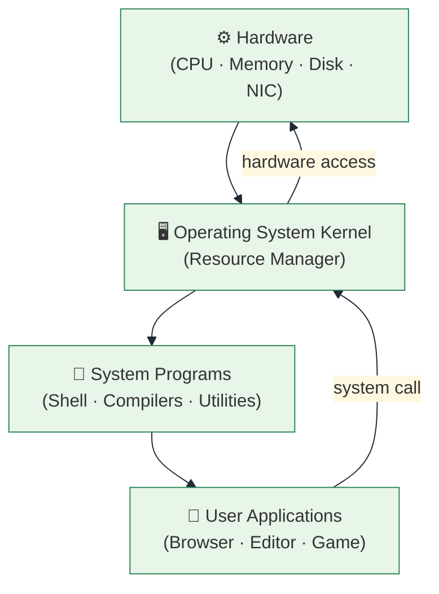
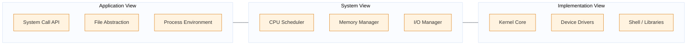
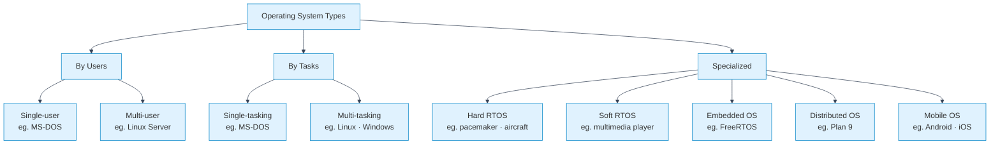
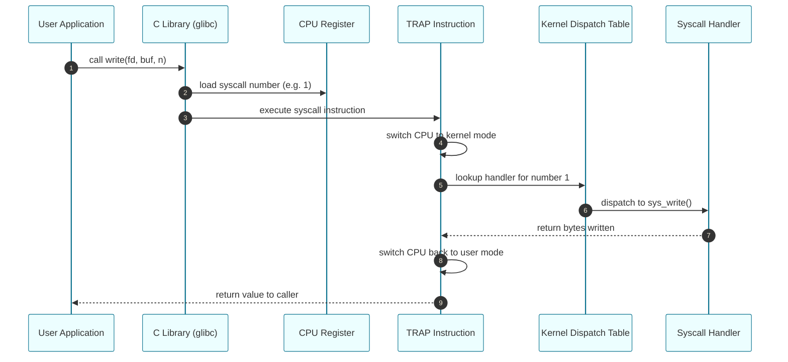
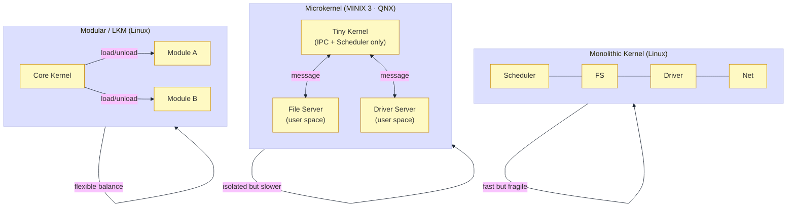
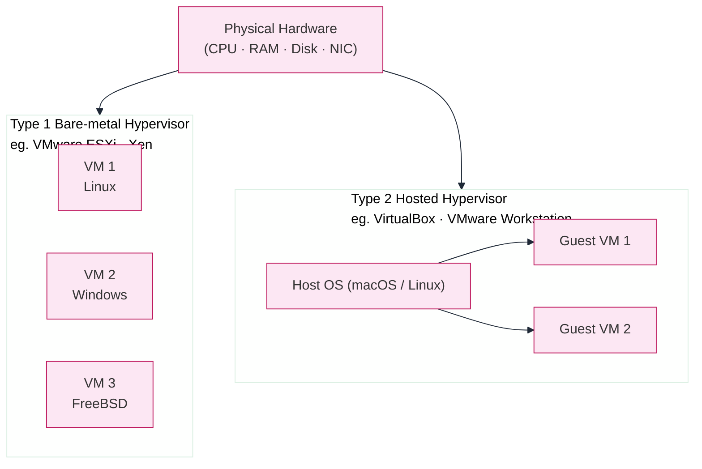

# Unit 1 (OS): Introduction to Operating Systems

Source: ITEX 220 Operating System — Unit 1 (5 Hours)

---

## Slide 1 — What Is an Operating System?

- Software layer between hardware and user applications.
- Two core roles: **resource manager** and **extended machine**.
- Every program uses it through **system calls**.
- Without an OS every program would control hardware directly — chaos.



---

## Slide 2 — Three Views of an OS

- **Application view**: a clean API of services (files, processes, network).
- **System view**: a manager that allocates CPU, memory, and I/O.
- **Implementation view**: kernel + drivers + libraries cooperating internally.



---

## Slide 3 — History and Evolution of OS

- Each era solved the biggest pain point of the previous one.
- Modern cloud and containers are the latest evolution step.

```mermaid
%%{init: {'theme':'base','themeVariables':{'primaryColor':'#f3e8ff','primaryBorderColor':'#7c3aed','lineColor':'#374151'}}}%%
flowchart LR
    B["1950s\nBatch Systems\n(no interaction)"]
    M["1960s\nMultiprogramming\n(no idle CPU)"]
    T["1960–70s\nTime-sharing\nUNIX born 1969"]
    P["1980s\nPersonal Computers\nDOS · Mac OS"]
    N["1990s\nNetwork OS\nClient-server"]
    C["2000s–now\nCloud · Mobile\nContainers · VMs"]

    B -->|solved idle CPU| M
    M -->|solved responsiveness| T
    T -->|solved cost of access| P
    P -->|solved connectivity| N
    N -->|solved scale| C
```



---

## Slide 4 — Types of Operating Systems



---

## Slide 5 — System Calls: The User/Kernel Gateway

- A system call is the **only controlled way** into kernel mode.
- Protected by a CPU **trap instruction** that raises privilege.
- The kernel validates, executes, and returns results safely.



---

## Slide 6 — OS Kernel Structures Compared



---

## Slide 7 — Virtual Machines

- A **hypervisor** presents each VM with a complete virtual computer.
- VMs are isolated: a crash or breach in one VM cannot affect another.
- Foundational to modern cloud (AWS EC2, GCP, Azure all use Type 1 hypervisors).



---

## Slide 8 — Exam Summary Card

| Topic | Key Fact to Remember |
|-------|---------------------|
| OS Definition | Resource manager + extended machine |
| Application view | Programs see clean system call API |
| System view | OS manages CPU, memory, I/O |
| History | batch → multiprog → timesharing → PC → cloud |
| Types | Single/multi user+task, RTOS, embedded, distributed |
| System call | Trap → kernel mode → dispatch table → handler |
| Monolithic | All in kernel, fast, poor fault isolation |
| Microkernel | Minimal kernel, IPC servers, excellent isolation |
| Type 1 VM | Hypervisor on bare metal — cloud standard |
| Type 2 VM | Hypervisor on host OS — developer use |

---

## Slide 9 — Student Verification Activity

- Read `01_Theory/Unit1_Detailed_Notes.md` for deep coverage.
- Tick each item in `01_Theory/Topic_Checklist.md`.
- Run C++ validation suite to verify all five concepts programmatically:

```bash
cd "03_Practicals_CPP"
bash scripts/validate_all.sh
```

- Expected result: all five programs print `Validation: PASS`.
