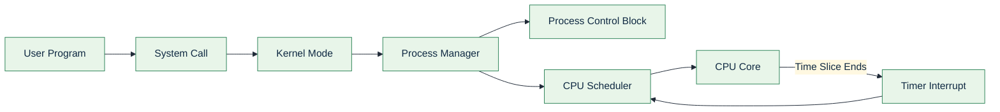
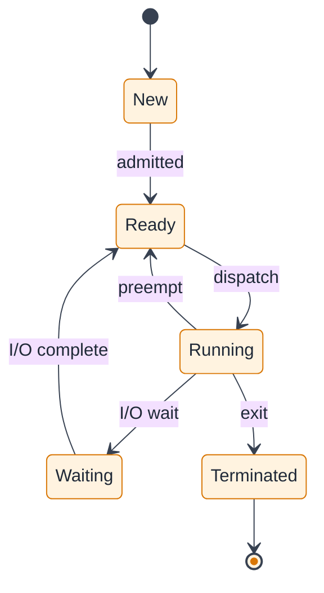
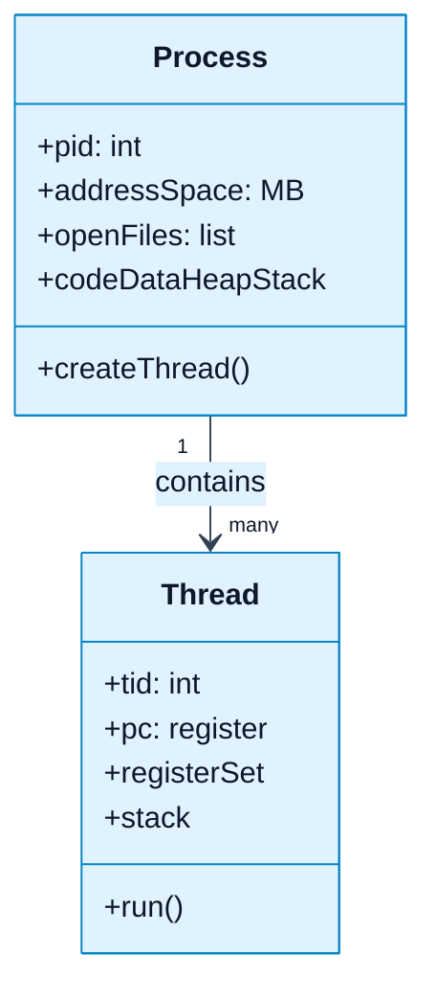
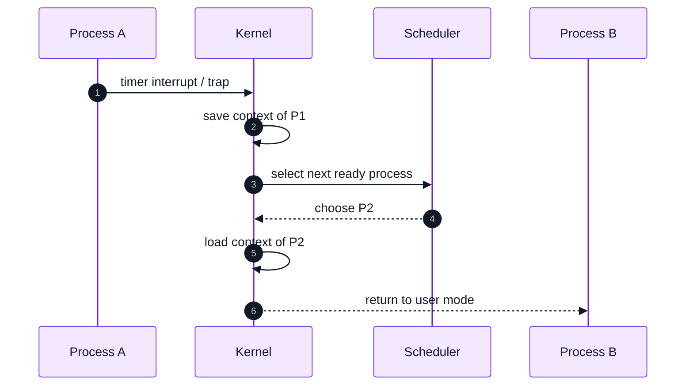
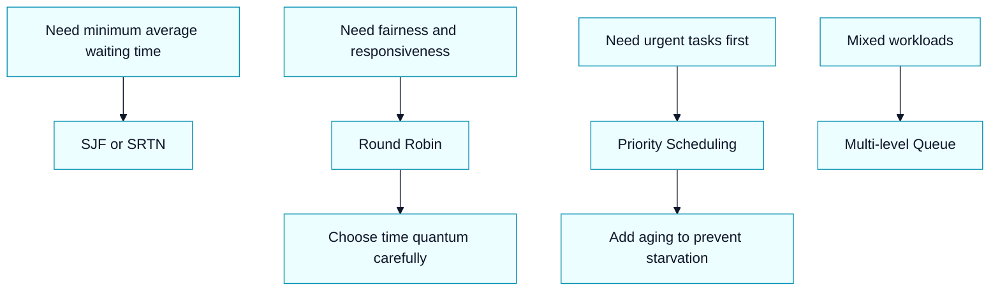

# Unit 2 (OS): Process, Process Management, Threads, and Scheduling

Source baseline: ITEX 220 Operating System syllabus (Unit Two topic list from your PDF)

---

## 1. Why Unit 2 Matters

- The OS must run many programs safely and efficiently.
- Unit 2 explains how CPU time is shared using processes and threads.
- These concepts drive performance, responsiveness, and correctness.



---

## 2. Process Model and PCB

- A process is a program in execution.
- Core states: New, Ready, Running, Waiting, Terminated.
- PCB stores process identity and execution context.
- Context switch = save current PCB state and restore next PCB state.



---

## 3. Process vs Thread

- Process: heavy-weight unit with separate address space.
- Thread: light-weight execution path inside a process.
- Threads share process resources but keep their own stack and registers.
- User threads are fast to create; kernel threads are visible to OS scheduler.



---

## 4. Context Switch (Execution Story)

- Triggered by timer interrupt, system call, or I/O event.
- OS saves old context, picks next ready process, restores new context.
- More context switches improve fairness but add overhead.



---

## 5. IPC and Synchronization Essentials

- IPC mechanisms: shared memory, message passing, pipes, sockets.
- Race condition: result depends on non-deterministic execution order.
- Critical section: code region touching shared data.
- Mutual exclusion tools: busy waiting, sleep/wakeup, semaphores, monitors, message passing.

Quick rule:

$$
\text{Safe Concurrent Update} = \text{Atomicity} + \text{Mutual Exclusion} + \text{Progress}
$$

---

## 6. Scheduling Algorithms (Unit 2 Core)

- FCFS: simple, may cause convoy effect.
- SJF/SRTN: good average waiting time, needs burst estimation.
- Round Robin: best for interactive systems, depends on time quantum.
- Priority scheduling: urgent tasks first, can starve low priority tasks.
- Multi-level queue: separate classes of workloads with distinct policies.



---

## 7. Exam-Focused Summary (Unit 2)

- Be ready to draw process state transition diagram.
- Explain PCB fields and context switching steps.
- Differentiate process and thread with at least 3 points.
- Compare FCFS, SJF, SRTN, RR, and Priority with one use-case each.
- Explain race condition and one mutual exclusion technique clearly.

---

## 8. Fast Revision Card

- Process = resource container + execution context.
- Thread = lightweight execution unit inside a process.
- Scheduler objective = fairness + throughput + response time.
- Synchronization objective = correctness under concurrency.
- Unit 2 links directly to deadlock and memory units.

---

## 9. Student Verification Activity (Practical)

- Run `thread_race_demo.py` to observe race condition and mutual exclusion.
- Use `Verification_Guide.md` to map the output to Unit 2 theory.
- Verify section 5 claims directly by comparing without-lock vs with-lock results.

Run command:

```bash
cd "Unit 2"
python3 thread_race_demo.py
```

